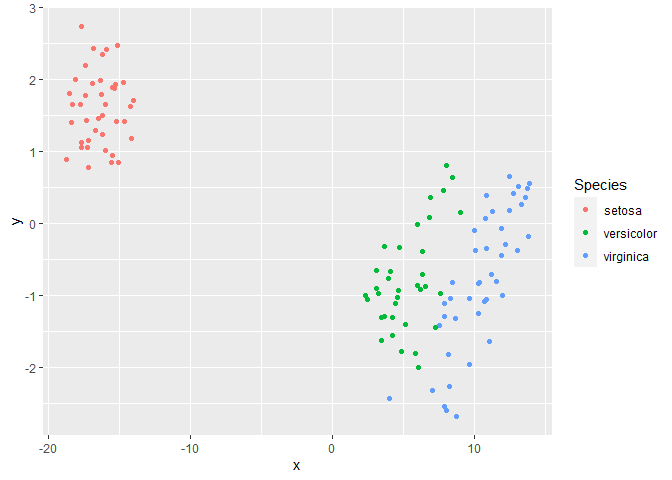
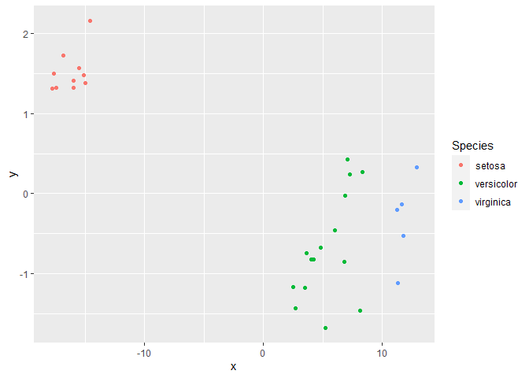
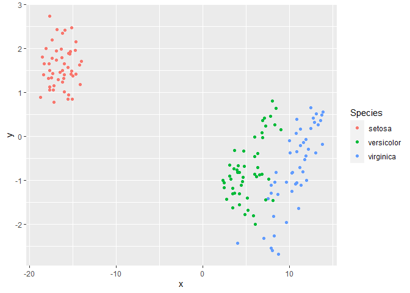

<!-- README.md is generated from README.Rmd. Please edit that file -->

# RTSNEpred

<!-- badges: start -->
<!-- badges: end -->

The goal of RTSNEpred is to …

## Installation

<!-- You can install the released version of RTSNEpred from [CRAN](https://CRAN.R-project.org) with: -->

You can install the released version of RTSNEpred from github

``` r
library(devtools)
install_github("chenxuepu/RTSNEpred")
## install.packages("RTSNEpred")
```

## Example

This is a basic example which shows you how to solve a common problem:

``` r
library(RTSNEpred)
library(ggplot2)
library(magrittr)
set.seed(123)
iris_index <- sample(1:nrow(iris),size = floor(0.8*nrow(iris)))
iris_train <- iris[iris_index,]
iris_test <- iris[-iris_index,]
set.seed(123)
iris_tsne <- train_tsne(iris_train[,1:4])
iris_pred <- predict(object = iris_tsne,data = iris_test[,1:4],k = 3) %>%
  as.data.frame() %>%
  cbind(iris_test$Species) %>%
  `names<-`(c("x","y","Species"))
## basic example code
```

``` r
iris_tsne %$%
  Y %>%
  as.data.frame() %>%
  cbind(iris_train$Species) %>%
  `names<-`(c("x","y","Species")) %>%
  ggplot(aes(x=x,y=y,color = Species)) +
  geom_point()
```



``` r
ggplot(iris_pred,aes(x=x,y=y,color = Species)) +
  geom_point()
```



``` r
iris_tsne %$%
  Y %>%
  as.data.frame() %>%
  cbind(iris_train$Species) %>%
  `names<-`(c("x","y","Species")) %>%
  rbind(iris_pred) %>%
  ggplot(aes(x=x,y=y,color = Species)) +
  geom_point()
```


